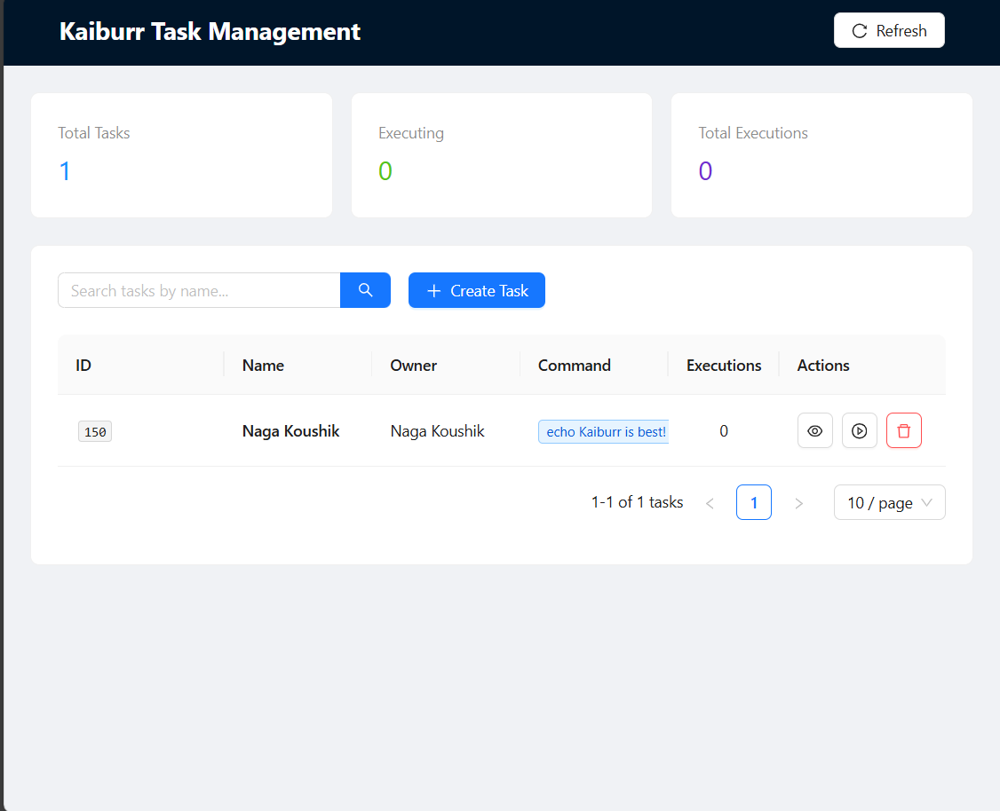
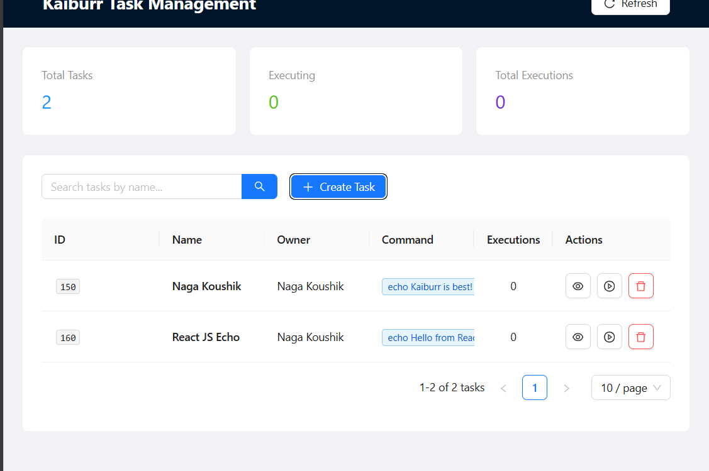
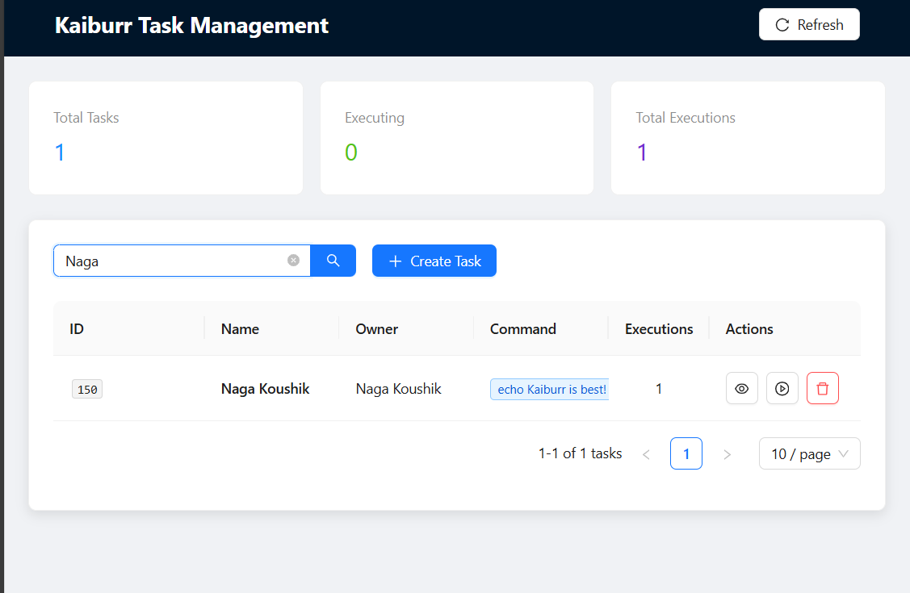
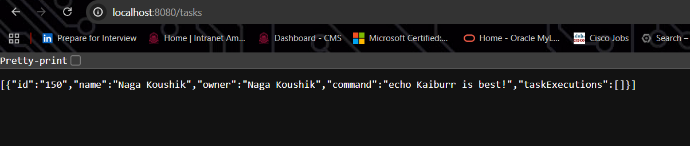
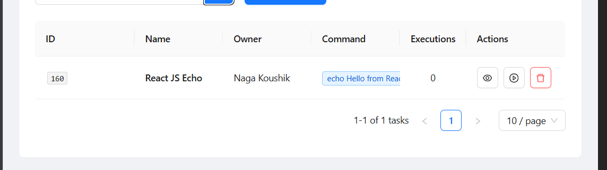
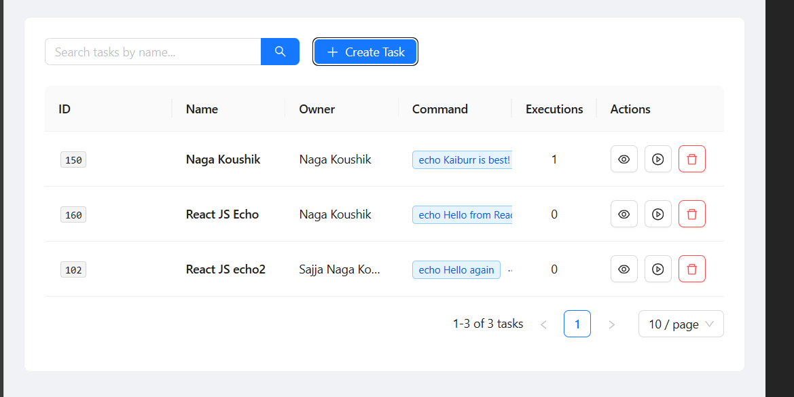
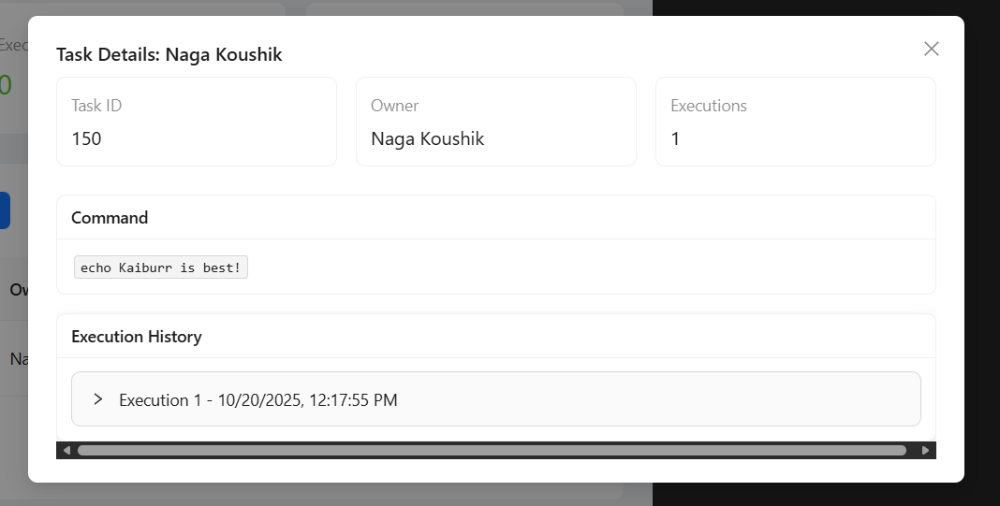
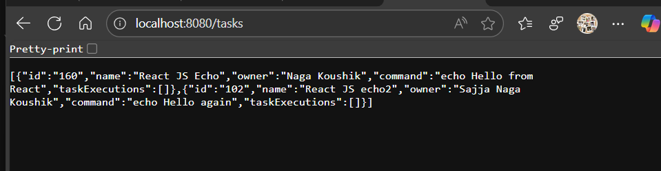

# 💻 Kaiburr Assessment 2025 — Task 3  
## Web UI Forms (React + TypeScript + Ant Design)

### 📘 Overview
This project implements a **React 19** frontend for the Java REST API created in **Task 1**.  
It provides a clean and accessible **web interface** for managing “Task” objects — allowing users to **create**, **view**, **search**, **delete**, **execute**, and **view command outputs** directly from the UI.

The design focuses on **usability**, **responsiveness**, and **accessibility**, using **Ant Design components** and **Axios** for REST API communication.

---

### 🧠 Tech Stack
| Component | Technology Used |
|------------|-----------------|
| Frontend Framework | React 19 |
| Language | TypeScript |
| UI Library | Ant Design |
| HTTP Client | Axios |
| Build Tool | Vite |
| Backend API | Java Spring Boot (Task 1) |
| CSS Framework | Ant Design + Tailwind (optional) |

---

### 📂 Project Structure
```
kaiburr-task3-webui/
│
├── src/
│ ├── api/
│ │ └── taskService.ts
│ ├── components/
│ │ ├── TaskForm.tsx
│ │ ├── TaskList.tsx
│ │ ├── TaskOutputModal.tsx
│ ├── pages/
│ │ └── Dashboard.tsx
│ ├── App.tsx
│ ├── main.tsx
│ └── index.css
│
├── public/
├── package.json
├── tsconfig.json
├── vite.config.ts
└── README.md
```


---

### ⚙️ Setup Instructions

#### **1️⃣ Clone the Repository**
```bash
cd kaiburr-task-ui
```

#### Install Dependencies
```
npm install
```
In src/api/taskService.ts, update the base URL to match your backend (Task 1) endpoint:

```
const API_BASE_URL = "http://localhost:8080";
```

#### Run the Application
```
npm run dev
```

#### Paste this Link in Browser
👉 http://localhost:5173


## Screenshorts of Output


 
 
 
 
 
 
 
 


